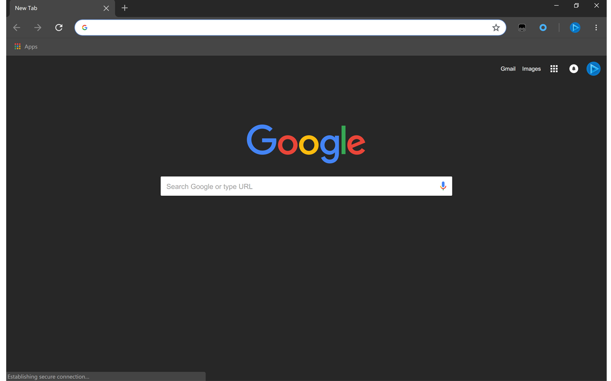

# Chrome Dark Theme
Simple dark theme for Google Chrome Material Refresh UI.

# Install
Go to `chrome://extensions` and open developer mode.

## From packed `.crx` (Recommended)
Drag and drop to install.

> You can get packed `.crx` file from [releases](https://github.com/the1812/chrome-dark-theme/releases).
## From source
`Load unpacked` → select this repository folder.
> Install from source may cause security popups every time you launch Chrome.
